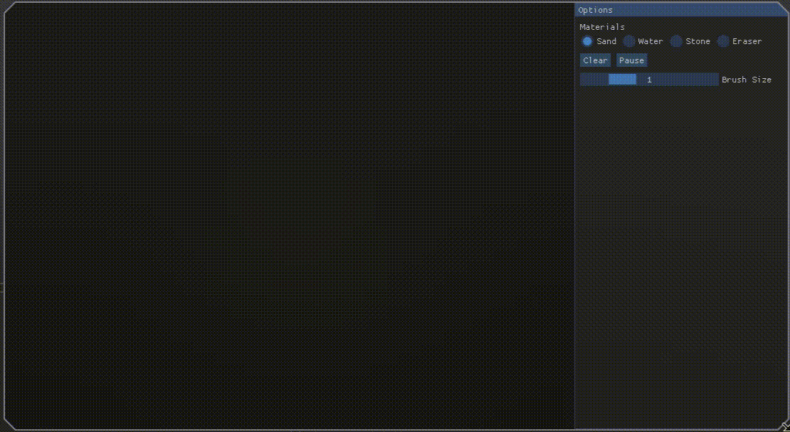

# Falling Sand Simulator

A cellular automaton sandbox built in C++ with SFML and ImGui. Sand, water, and stone interact on a grid — sand piles and cascades, water flows around obstacles and seeps through sand, stone stays fixed.



## Features

- Real-time cellular automaton simulation on a fixed grid
- Multiple material types: sand, water, stone
- Materials interact physically — water flows around stone, sand settles and cascades, sand submerged under water has a tendency to slide and resettle
- Adjustable brush size for placing material
- Simulation time controls: pause, play, step
- ImGui-based control panel

## Controls

- **Left click**: place selected material
- **Brush size**: adjustable via the panel
- **Material select**: choose sand, water, or stone
- **Pause / Play / Step**: control simulation time from the panel

## How it works

Each cell on the grid holds a material type. Every simulation tick, the grid is scanned and each non-empty cell is updated based on its type:

- **Sand** falls straight down if possible, otherwise diagonally, and sinks through water beneath it
- **Water** falls down if possible, otherwise spreads sideways
- **Stone** is static and blocks movement

The scan direction alternates randomly between left-to-right and right-to-left each frame to avoid directional bias in how material spreads.

## Build

Built with C++23, SFML, and ImGui.

**Linux/macOS:**
```bash
./build.sh
```
This compiles and launches the application.

**Windows:**
`build.sh` is not supported on Windows. Run the same steps manually:
```bash
cmake -B build -DCMAKE_BUILD_TYPE=Debug -DCMAKE_EXPORT_COMPILE_COMMANDS=ON
cmake --build build
```
Then run the built executable at `build/bin/particles` (or `build\bin\particles.exe` depending on generator).